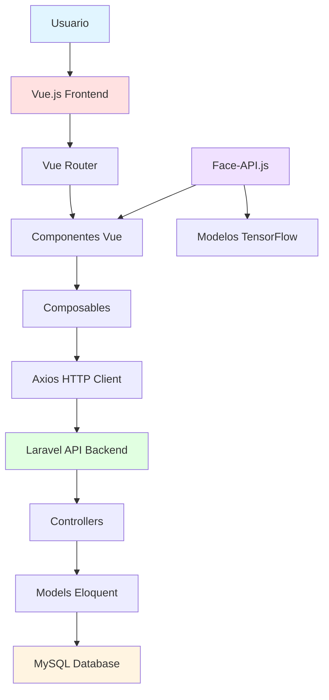

# 📋 INFORME FINAL - SISTEMA DE REGISTRO DE ASISTENCIAS CON RECONOCIMIENTO FACIAL

**Proyecto:** Sistema de Control de Asistencias con IA  
**Tecnologías:** Laravel 12 + Vue 3 + Face-API.js  
**Autor:** [Tu Nombre]  
**Fecha:** Diciembre 2025

---

## 📑 ÍNDICE

1. [Funcionalidades Principales](#1-funcionalidades-principales)
2. [Arquitectura y Tecnologías](#2-arquitectura-y-tecnologías)
3. [Explicación del Código](#3-explicación-del-código)
4. [Desafíos y Soluciones](#4-desafíos-y-soluciones)
5. [Conclusiones](#5-conclusiones)

---

## 1. FUNCIONALIDADES PRINCIPALES

### 1.1 Módulo de Autenticación

**Login y Registro**
- Formulario de inicio de sesión con validación
- Sistema de roles (Admin, Supervisor, Docente)
- Autenticación mediante Laravel Sanctum (tokens)
- Cierre de sesión seguro

**Gestión de Perfil**
- Visualización de datos del usuario
- Cambio de contraseña
- Actualización de información personal
- Eliminación de cuenta

---

### 1.2 Dashboard Interactivo

**Estadísticas en Tiempo Real**
- Total de personal activo
- Total de estudiantes
- Asistencias del día
- Gráficos de asistencia semanal

**Visualizaciones con Chart.js**
- Gráfico de barras: Asistencias por área
- Gráfico de líneas: Tendencia semanal
- Gráfico circular: Estado de asistencias hoy (Presente/Tarde/Falta)
- Gráfico de empleados por mes

**Tablas Dinámicas**
- Últimas asistencias registradas
- Personal reciente
- Filtros y búsqueda en tiempo real

---

### 1.3 Registro de Asistencias con IA

**Reconocimiento Facial Automático**
- Detección de rostros en tiempo real usando Face-API.js
- Comparación con descriptores faciales almacenados
- Registro automático de entrada/salida
- Validación de ventanas de tiempo

**Funcionalidades:**
- Activación/desactivación de cámara
- Feedback visual del reconocimiento
- Mensajes de estado en tiempo real
- Anti-rebote (evita registros duplicados)

**Lógica de Validación:**
- **Estudiantes:** Marcan solo entrada (1h antes hasta 15min después)
- **Personal:** Marca entrada y salida (30min antes hasta 15min después)
- Estados: Presente, Tarde, Falta

---

### 1.4 Gestión de Asistencias

**Vista por Grupos**
- Listado de grupos con cantidad de asistencias
- Filtro por área y búsqueda
- Selección de grupo para ver detalle

**Tabla Semanal**
- Vista de asistencias de Lunes a Domingo
- Navegación entre semanas
- Edición manual de asistencias
- Vista de salidas (solo personal)

**Acciones del Usuario:**
- Ver historial de asistencias
- Editar estado de asistencia
- Cambiar hora de entrada/salida
- Exportar reportes

---

### 1.5 Gestión de Personal

**CRUD Completo**
- Crear nuevo personal/estudiante
- Editar información
- Eliminar registros
- Asignación masiva de grupos

**Registro Facial**
- Captura de rostro con cámara
- Análisis de calidad del rostro
- Almacenamiento de descriptores faciales (128 dimensiones)
- Validación de DNI único

**Formulario Inteligente**
- Validación en tiempo real
- Campos dinámicos según tipo de persona
- Selección de área y grupo
- Carga de foto de perfil

---

### 1.6 Gestión de Áreas y Grupos

**Áreas**
- Crear/editar/eliminar áreas
- Asignar horarios por área
- Visualización de grupos por área

**Grupos**
- Crear grupos con nivel, grado y sección
- Asignar tutor (docente)
- Gestión de estudiantes por grupo
- Tarjetas visuales con información

---

### 1.7 Gestión de Horarios

**Configuración de Horarios**
- Definir hora de entrada y salida por área
- Aplicación automática a todas las personas del área
- Validación de horarios válidos

---

### 1.8 Gestión de Usuarios

**Administración de Cuentas**
- Crear usuarios con diferentes roles
- Vincular usuario a persona
- Cambiar contraseñas
- Activar/desactivar usuarios

**Roles y Permisos:**
- **Admin:** Acceso total
- **Supervisor:** Gestión de personal
- **Docente:** Solo sus grupos de estudiantes

---

## 2. ARQUITECTURA Y TECNOLOGÍAS

### 2.1 Estructura del Proyecto

```
app-RegistroAsistencia/
├── app/                          # Backend Laravel
│   ├── Http/
│   │   ├── Controllers/          # Controladores REST
│   │   │   ├── AsistenciaController.php
│   │   │   ├── PersonaController.php
│   │   │   ├── AuthController.php
│   │   │   └── ...
│   │   └── Middleware/           # Middleware de autenticación
│   ├── Models/                   # Modelos Eloquent
│   │   ├── Asistencia.php
│   │   ├── Persona.php
│   │   ├── Usuario.php
│   │   └── ...
│   └── ...
├── database/
│   ├── migrations/               # Migraciones de BD
│   └── seeders/                  # Datos de prueba
├── resources/
│   └── js/                       # Frontend Vue
│       ├── app.vue               # Componente raíz
│       ├── router.js             # Rutas Vue Router
│       ├── composables/          # Lógica reutilizable
│       │   ├── useAuth.js
│       │   ├── useAsistencias.js
│       │   └── useTheme.js
│       ├── layout/               # Componentes de layout
│       │   ├── Header.vue
│       │   ├── Sidebar.vue
│       │   └── Footer.vue
│       └── modules/              # Módulos por funcionalidad
│           ├── dashboard/
│           ├── asistencias/
│           ├── personal/
│           └── ...
├── routes/
│   └── api.php                   # Rutas del API REST
└── public/
    └── models/                   # Modelos de Face-API.js
```

---

### 2.2 Stack Tecnológico

#### **Backend**

| Tecnología | Versión | Propósito |
|------------|---------|-----------|
| **PHP** | 8.2 | Lenguaje del servidor |
| **Laravel** | 12.0 | Framework PHP |
| **Laravel Sanctum** | 4.2 | Autenticación API (tokens) |
| **MySQL** | 8.0 | Base de datos relacional |
| **Carbon** | 3.x | Manejo de fechas y horas |

**Características Laravel:**
- API RESTful
- Eloquent ORM para modelos
- Migraciones y seeders
- Middleware de autenticación
- Validación de datos

---

#### **Frontend**

| Tecnología | Versión | Propósito |
|------------|---------|-----------|
| **Vue.js** | 3.5.22 | Framework JavaScript reactivo |
| **Vue Router** | 4.5.1 | Enrutamiento SPA |
| **Axios** | 1.13.1 | Cliente HTTP |
| **TailwindCSS** | 4.1.13 | Framework CSS utility-first |
| **Vite** | 7.0.4 | Build tool y dev server |
| **Face-API.js** | 0.22.2 | Reconocimiento facial con IA |
| **Chart.js** | 4.5.1 | Gráficos interactivos |
| **Date-fns** | 4.1.0 | Utilidades de fechas |
| **FontAwesome** | 7.1.0 | Iconos |

**Características Vue:**
- Composition API
- Composables reutilizables
- Reactive state management
- Componentes modulares

---

#### **Inteligencia Artificial**

**Face-API.js**
- Basado en TensorFlow.js
- Modelos pre-entrenados:
  - `tiny_face_detector` - Detección de rostros
  - `face_landmark_68` - Puntos faciales
  - `face_recognition` - Descriptores de 128 dimensiones
- Procesamiento en el navegador (client-side)
- Umbral de similitud: 0.5 (50%)

---

### 2.3 Arquitectura de la Aplicación



**Flujo de Datos:**
1. Usuario interactúa con la interfaz Vue
2. Componentes Vue usan composables para lógica
3. Axios envía peticiones HTTP al backend Laravel
4. Laravel procesa, valida y consulta la base de datos
5. Respuesta JSON regresa al frontend
6. Vue actualiza la interfaz reactivamente

---

### 2.4 Base de Datos

**Modelo Entidad-Relación:**

```
usuarios (1) ──── (1) personas
                      │
                      ├── (N) asistencias
                      ├── (N) reconocimientos
                      └── (N) grupos ──── (N) areas ──── (1) horarios
```

**Tablas Principales:**

- `usuarios` - Cuentas de acceso
- `personas` - Datos personales (estudiantes/personal)
- `asistencias` - Registros de entrada/salida
- `reconocimientos` - Descriptores faciales
- `grupos` - Agrupaciones (grados, departamentos)
- `areas` - Áreas organizacionales
- `horarios` - Horarios por área

---

## 3. EXPLICACIÓN DEL CÓDIGO

### 3.1 Ejemplo 1: Reconocimiento Facial con Face-API.js

**Archivo:** `RegistroAsistencia.vue`

```javascript
/**
 * FUNCIÓN: Cargar descriptores faciales desde el backend
 * 
 * PROPÓSITO: Obtiene los descriptores faciales de todas las personas
 * registradas y los convierte en objetos LabeledFaceDescriptors
 * para que Face-API.js pueda compararlos con rostros detectados.
 */
const cargarDescriptores = async () => {
  estado.message = 'Cargando rostros...'

  try {
    // 1. Obtener descriptores del backend
    const response = await axios.get('/reconocimientos/descriptores')
    const data = response.data.data || response.data

    // 2. Validar que existan datos
    if (!data || data.length === 0) {
      estado.message = 'No hay rostros registrados en el sistema.'
      return null
    }

    const labeled = []
    
    // 3. Procesar cada descriptor
    data.forEach(rec => {
      try {
        // 3.1 Parsear el descriptor (puede venir como string JSON)
        const descriptorArray = typeof rec.face_descriptor === 'string' 
             ? JSON.parse(rec.face_descriptor) 
             : rec.face_descriptor

        // 3.2 Convertir a Float32Array (formato requerido por Face-API)
        const descriptorFloat = new Float32Array(descriptorArray)

        // 3.3 VALIDACIÓN CRÍTICA: Debe tener exactamente 128 dimensiones
        // Si no, Face-API.js lanzará error de "euclideanDistance"
        if (descriptorFloat.length === 128) {
          labeled.push(new faceapi.LabeledFaceDescriptors(
            String(rec.id_persona),  // Label: ID de la persona
            [descriptorFloat]         // Array de descriptores
          ))
        }
      } catch (e) {
        console.error(`Error procesando rostro ID ${rec.id_persona}`, e)
      }
    })

    // 4. Validar que se procesaron descriptores válidos
    if (labeled.length === 0) {
        estado.message = "Error: Datos de rostros inválidos en BD."
        return null
    }

    // 5. Crear el matcher con umbral de similitud 0.5
    // Valores más bajos = más estricto, más altos = más permisivo
    estado.message = 'Escaneando...'
    return new faceapi.FaceMatcher(labeled, 0.5)

  } catch (error) {
    console.error("Error al cargar descriptores:", error)
    estado.message = "Error de conexión."
    return null
  }
}
```

**Conceptos clave:**
- **Descriptores faciales:** Vector de 128 números que representa un rostro
- **LabeledFaceDescriptors:** Asocia un descriptor con un ID (label)
- **FaceMatcher:** Compara rostros detectados con los almacenados
- **Umbral 0.5:** Distancia euclidiana máxima para considerar coincidencia

---

### 3.2 Ejemplo 2: Validación de Ventanas de Tiempo

**Archivo:** `AsistenciaController.php`

```php
/**
 * FUNCIÓN: Validar ventana de tiempo para registro de entrada
 * 
 * PROPÓSITO: Determinar si la hora actual está dentro de la ventana
 * permitida para marcar asistencia, según el tipo de persona.
 * 
 * REGLAS DE NEGOCIO:
 * - Estudiantes: 1 hora antes hasta 15 min después
 * - Personal: 30 min antes hasta 15 min después
 */

// 1. Obtener hora actual con zona horaria de Perú
$horaActualCarbon = Carbon::now('America/Lima');

// 2. Obtener horario configurado para el área de la persona
$horario = Horario::where('id_area', $persona->id_area)->first();

if (!$horario) {
    return response()->json([
        'message' => 'No hay horario configurado para esta área',
        'persona' => $persona
    ], 400);
}

// 3. IMPORTANTE: Parsear con fecha completa para evitar bugs de comparación
// Si solo parseamos '10:00:00', Carbon puede asumir fecha incorrecta
$fechaHoy = $horaActualCarbon->toDateString();  // Ej: '2025-12-03'
$horaEntradaProgramada = Carbon::parse(
    $fechaHoy . ' ' . $horario->hora_entrada,  // '2025-12-03 10:00:00'
    'America/Lima'
);

// 4. Calcular ventanas según tipo de persona
if ($persona->tipo_persona === 'estudiante') {
    // ESTUDIANTES: 1 hora antes hasta 15 min después
    $ventanaInicio = $horaEntradaProgramada->copy()->subMinutes(60);
    $ventanaFin = $horaEntradaProgramada->copy()->addMinutes(15);
} else {
    // PERSONAL: 30 min antes hasta 15 min después
    $ventanaInicio = $horaEntradaProgramada->copy()->subMinutes(30);
    $ventanaFin = $horaEntradaProgramada->copy()->addMinutes(15);
}

// 5. Validar que esté dentro de la ventana
if ($horaActualCarbon->lt($ventanaInicio)) {
    // Muy temprano
    return response()->json([
        'message' => 'Aún no puede marcar asistencia. Intente después de las ' 
                   . $ventanaInicio->format('H:i'),
        'persona' => $persona
    ], 400);
}

if ($horaActualCarbon->gt($ventanaFin)) {
    // Muy tarde
    return response()->json([
        'message' => 'Tiempo de marcado expirado. Contacte al encargado.',
        'persona' => $persona
    ], 400);
}

// 6. Dentro de la ventana: Determinar estado (Presente o Tarde)
if ($horaActualCarbon->lte($horaEntradaProgramada)) {
    $asistencia->estado_asistencia = 'Presente';
} else {
    $asistencia->estado_asistencia = 'Tarde';
}
```

**Conceptos clave:**
- **Carbon:** Librería PHP para manejo de fechas
- **copy():** Crea copia para no modificar el original
- **lt/gt/lte:** Less than, greater than, less than or equal
- **Zona horaria:** Crítico para aplicaciones en producción

---

### 3.3 Ejemplo 3: Composable Reutilizable (useAsistencias)

**Archivo:** `useAsistencias.js`

```javascript
/**
 * COMPOSABLE: useAsistencias
 * 
 * PROPÓSITO: Encapsular toda la lógica relacionada con asistencias
 * para reutilizarla en múltiples componentes.
 * 
 * VENTAJAS:
 * - Separación de lógica y presentación
 * - Reutilización de código
 * - Testing más fácil
 * - Estado reactivo compartido
 */

import { ref, computed } from 'vue'
import api from '@/axiosConfig'
import { startOfWeek, addDays, format, subDays } from 'date-fns'

export function useAsistencias() {
  // ========================================
  // ESTADO REACTIVO
  // ========================================
  
  // Fecha de referencia (cualquier día de la semana visible)
  const currentDate = ref(new Date())
  
  // Array de asistencias: [{id_persona, persona: {...}, lunes: {...}, ...}]
  const asistencias = ref([])
  
  // Estados de carga y error
  const loading = ref(false)
  const error = ref(null)

  // ========================================
  // COMPUTED PROPERTIES
  // ========================================
  
  /**
   * Calcula el rango de la semana actual (Lunes a Viernes)
   * Retorna objeto con fechas de inicio/fin y string para mostrar
   */
  const weekRange = computed(() => {
    // Obtener lunes de la semana
    const start = startOfWeek(currentDate.value, { weekStartsOn: 1 })
    
    // Obtener viernes (lunes + 4 días)
    const friday = addDays(start, 4)
    
    return {
      start,
      end: friday,
      // String para mostrar: "Semana del 01 Dic al 05 Dic 2025"
      display: `Semana del ${format(start, 'dd MMM')} al ${format(friday, 'dd MMM yyyy')}`,
      // Fecha para enviar al backend (formato ISO)
      apiDate: format(start, 'yyyy-MM-dd')
    }
  })

  // ========================================
  // FUNCIONES
  // ========================================
  
  /**
   * Normaliza el resumen de asistencias del backend
   * Asegura estructura consistente para cada día
   */
  const normalizeResumen = (arr) => {
    return (arr || []).map(item => {
      const copy = { ...item }
      
      // Asegurar que persona existe
      copy.persona = copy.persona || {}
      
      // Normalizar cada día de la semana
      ['lunes', 'martes', 'miercoles', 'jueves', 'viernes', 'sabado', 'domingo']
        .forEach(dia => {
          let val = copy[dia]
          
          // Estructura por defecto (Falta)
          let normalized = {
            estado: 'F',
            hora_entrada: null
          }
          
          if (val) {
            // Si viene como objeto
            if (typeof val === 'object') {
              normalized = { ...val }
              
              // Normalizar estado a P/T/F
              let v = String(normalized.estado || '').trim().toLowerCase()
              if (v === 'presente' || v === 'p') normalized.estado = 'P'
              else if (v === 'tarde' || v === 't') normalized.estado = 'T'
              else if (v === 'falta' || v === 'f') normalized.estado = 'F'
              else normalized.estado = String(normalized.estado || 'F')
                                        .toUpperCase().substring(0, 1)
            }
            // Si viene como string (fallback)
            else {
              let v = String(val).trim().toLowerCase()
              if (v === 'presente' || v === 'p') normalized.estado = 'P'
              else if (v === 'tarde' || v === 't') normalized.estado = 'T'
              else if (v === 'falta' || v === 'f') normalized.estado = 'F'
              else normalized.estado = String(val).toUpperCase().substring(0, 1)
            }
          }
          
          copy[dia] = normalized
        })
      
      return copy
    })
  }

  /**
   * Obtiene asistencias de la semana desde el backend
   */
  const fetchAsistenciasSemana = async (opts = {}) => {
    loading.value = true
    error.value = null
    
    try {
      const dateToSend = opts.dateString || weekRange.value.apiDate
      
      const res = await api.get('/asistencias-semana', {
        params: { 
          date: dateToSend, 
          group_id: opts.group_id  // Opcional: filtrar por grupo
        }
      })

      // Normalizar respuesta
      const payload = Array.isArray(res.data) 
        ? res.data 
        : (res.data.data || res.data || [])
      
      asistencias.value = normalizeResumen(payload)
      return asistencias.value
      
    } catch (err) {
      console.error('Error cargando asistencias:', err)
      error.value = 'No se pudieron cargar las asistencias.'
      asistencias.value = []
      throw err
    } finally {
      loading.value = false
    }
  }

  /**
   * Navega a la semana anterior o siguiente
   */
  const navigateWeek = (direction, opts = {}) => {
    if (direction === 'prev') {
      currentDate.value = subDays(currentDate.value, 7)
    } else if (direction === 'next') {
      currentDate.value = addDays(currentDate.value, 7)
    }
    
    // Retornar promesa para que el caller pueda esperarla
    return fetchAsistenciasSemana(opts)
  }

  /**
   * Forzar recarga de la semana actual
   */
  const refreshWeek = (opts = {}) => {
    return fetchAsistenciasSemana(opts)
  }

  // ========================================
  // RETORNAR API PÚBLICA
  // ========================================
  return {
    // Estado
    asistencias,
    loading,
    error,
    weekRange,
    
    // Métodos
    navigateWeek,
    fetchAsistenciasSemana,
    refreshWeek
  }
}
```

**Conceptos clave:**
- **Composables:** Patrón de Vue 3 para lógica reutilizable
- **Reactive refs:** `ref()` crea variables reactivas
- **Computed:** Propiedades calculadas que se actualizan automáticamente
- **API pública:** Solo exponer lo necesario

---

### 3.4 Ejemplo 4: Middleware de Autenticación

**Archivo:** `router.js`

```javascript
/**
 * GUARD DE NAVEGACIÓN: Proteger rutas que requieren autenticación
 * 
 * PROPÓSITO: Verificar que el usuario esté autenticado antes de
 * permitir acceso a rutas protegidas.
 */

import { createRouter, createWebHistory } from 'vue-router'

const router = createRouter({
  history: createWebHistory(),
  routes: [
    {
      path: '/login',
      name: 'Login',
      component: () => import('@/modules/auth/pages/login.vue'),
      meta: { requiresAuth: false }  // Ruta pública
    },
    {
      path: '/dashboard',
      name: 'Dashboard',
      component: () => import('@/modules/dashboard/pages/Home.vue'),
      meta: { requiresAuth: true }  // Ruta protegida
    },
    // ... más rutas
  ]
})

/**
 * GUARD GLOBAL: Se ejecuta antes de cada navegación
 */
router.beforeEach((to, from, next) => {
  // 1. Verificar si la ruta requiere autenticación
  const requiresAuth = to.matched.some(record => record.meta.requiresAuth)
  
  // 2. Obtener token del localStorage
  const token = localStorage.getItem('auth_token')
  
  // 3. Lógica de redirección
  if (requiresAuth && !token) {
    // Ruta protegida sin token → Redirigir a login
    next({ 
      name: 'Login',
      query: { redirect: to.fullPath }  // Guardar destino original
    })
  } else if (!requiresAuth && token && to.name === 'Login') {
    // Ya autenticado intentando ir a login → Redirigir a dashboard
    next({ name: 'Dashboard' })
  } else {
    // Permitir navegación
    next()
  }
})

export default router
```

**Conceptos clave:**
- **Navigation Guards:** Interceptores de navegación
- **beforeEach:** Se ejecuta antes de cada cambio de ruta
- **meta:** Metadata personalizada en rutas
- **next():** Controla si se permite la navegación

---

### 3.5 Ejemplo 5: Gestión de Estado Reactivo

**Archivo:** `useAuth.js`

```javascript
/**
 * COMPOSABLE: useAuth
 * 
 * PROPÓSITO: Gestionar el estado de autenticación globalmente
 * Permite compartir el estado del usuario entre componentes
 */

import { ref, computed } from 'vue'
import api from '@/axiosConfig'
import { useRouter } from 'vue-router'

// ========================================
// ESTADO GLOBAL (fuera de la función)
// ========================================
// Al estar fuera, se comparte entre todas las instancias del composable
const usuario = ref(null)
const cargando = ref(false)

export function useAuth() {
  const router = useRouter()

  // ========================================
  // COMPUTED PROPERTIES
  // ========================================
  
  /**
   * Verifica si el usuario está autenticado
   */
  const isAuthenticated = computed(() => {
    return !!usuario.value && !!localStorage.getItem('auth_token')
  })

  /**
   * Verifica si el usuario es docente
   */
  const isDocente = computed(() => {
    return usuario.value?.rol === 'docente'
  })

  /**
   * Verifica si puede ver horarios de salida
   * Solo admin y supervisor
   */
  const canViewExitTimes = computed(() => {
    return ['admin', 'supervisor'].includes(usuario.value?.rol)
  })

  // ========================================
  // MÉTODOS
  // ========================================
  
  /**
   * Obtiene datos del usuario actual desde el backend
   */
  const fetchUsuarioActual = async () => {
    if (!localStorage.getItem('auth_token')) {
      usuario.value = null
      return
    }

    cargando.value = true
    try {
      const response = await api.get('/usuario-actual')
      usuario.value = response.data
    } catch (error) {
      console.error('Error obteniendo usuario:', error)
      // Si el token expiró, limpiar y redirigir
      if (error.response?.status === 401) {
        await logout()
      }
    } finally {
      cargando.value = false
    }
  }

  /**
   * Inicia sesión
   */
  const login = async (credentials) => {
    cargando.value = true
    try {
      const response = await api.post('/login', credentials)
      
      // Guardar token
      localStorage.setItem('auth_token', response.data.token)
      
      // Obtener datos del usuario
      await fetchUsuarioActual()
      
      // Redirigir al dashboard
      router.push({ name: 'Dashboard' })
      
      return response.data
    } catch (error) {
      throw error
    } finally {
      cargando.value = false
    }
  }

  /**
   * Cierra sesión
   */
  const logout = async () => {
    try {
      await api.post('/logout')
    } catch (error) {
      console.error('Error en logout:', error)
    } finally {
      // Limpiar estado local
      localStorage.removeItem('auth_token')
      usuario.value = null
      
      // Redirigir a login
      router.push({ name: 'Login' })
    }
  }

  // ========================================
  // RETORNAR API PÚBLICA
  // ========================================
  return {
    // Estado
    usuario,
    cargando,
    
    // Computed
    isAuthenticated,
    isDocente,
    canViewExitTimes,
    
    // Métodos
    fetchUsuarioActual,
    login,
    logout
  }
}
```

**Conceptos clave:**
- **Estado global:** Variables fuera de la función se comparten
- **Computed properties:** Propiedades derivadas del estado
- **LocalStorage:** Persistencia del token entre sesiones
- **Error handling:** Manejo de tokens expirados

---

## 4. DESAFÍOS Y SOLUCIONES

### 4.1 Desafío: Bug de Comparación de Horas en Carbon

**Problema:**
Al validar ventanas de tiempo, Carbon comparaba incorrectamente las horas. Por ejemplo, consideraba que `09:55 > 10:15` (falso).

**Causa:**
```php
// INCORRECTO
$horaEntradaProgramada = Carbon::parse('10:00:00');
```

Al parsear solo la hora sin fecha, Carbon asumía fechas incorrectas, causando comparaciones erróneas.

**Solución:**
```php
// CORRECTO
$fechaHoy = $horaActualCarbon->toDateString();
$horaEntradaProgramada = Carbon::parse($fechaHoy . ' ' . $horario->hora_entrada, 'America/Lima');
```

Parsear con la fecha completa (`2025-12-03 10:00:00`) asegura comparaciones correctas.

**Lección aprendida:** Siempre incluir contexto completo (fecha + hora + zona horaria) en operaciones con fechas.

---

### 4.2 Desafío: Descriptores Faciales Inválidos

**Problema:**
Face-API.js lanzaba error: `"euclideanDistance requires vectors of equal length"`.

**Causa:**
Los descriptores faciales almacenados en la base de datos no tenían exactamente 128 dimensiones.

**Solución:**
```javascript
// Validar longitud antes de usar
if (descriptorFloat.length === 128) {
  labeled.push(new faceapi.LabeledFaceDescriptors(
    String(rec.id_persona),
    [descriptorFloat]
  ))
} else {
  console.warn(`Descriptor inválido para persona ${rec.id_persona}: ${descriptorFloat.length} dimensiones`)
}
```

**Lección aprendida:** Siempre validar datos antes de pasarlos a librerías externas, especialmente con IA.

---

### 4.3 Desafío: Personas Sin Área Asignada

**Problema:**
Al intentar registrar asistencia, el sistema devolvía error 400 sin mensaje claro.

**Causa:**
Personas con reconocimiento facial no tenían `id_area` asignado, por lo que no se podía obtener el horario.

**Solución:**
1. **Validación en el backend:**
```php
if (!$horario) {
    return response()->json([
        'message' => 'No hay horario configurado para esta área',
        'persona' => $persona
    ], 400);
}
```

2. **Asignación masiva de áreas:**
```sql
UPDATE personas 
SET id_area = 1 
WHERE id_persona IN (30, 31, 32, 33);
```

3. **Validación en el formulario:**
```vue
<select v-model="form.id_area" required>
  <option value="">Seleccione un área</option>
  <option v-for="area in areas" :key="area.id_area" :value="area.id_area">
    {{ area.nombre_area }}
  </option>
</select>
```

**Lección aprendida:** Implementar validaciones en múltiples capas (frontend, backend, base de datos).

---

### 4.4 Desafío: Mensajes de Error No Visibles en Frontend

**Problema:**
El backend enviaba mensajes de error específicos, pero el frontend mostraba siempre "Registro procesado".

**Causa:**
El catch del frontend no extraía el mensaje del backend:
```javascript
// INCORRECTO
catch (e) {
  estado.message = 'Registro procesado.'  // Mensaje genérico
}
```

**Solución:**
```javascript
// CORRECTO
catch (e) {
  // Extraer mensaje del backend
  const errorMsg = e.response?.data?.message || 
                   e.response?.data?.error || 
                   'Error al procesar registro'
  
  estado.message = errorMsg  // Mensaje específico
}
```

**Lección aprendida:** Siempre propagar mensajes de error del backend al frontend para mejor UX.

---

### 4.5 Desafío: Caché del Navegador

**Problema:**
Después de actualizar el código, el navegador seguía usando la versión antigua.

**Causa:**
El navegador cachea archivos JavaScript para mejorar rendimiento.

**Solución:**
1. **Hard refresh:** `Ctrl + Shift + R` o `Ctrl + F5`
2. **Limpiar caché:** `Ctrl + Shift + Delete`
3. **Vite hash automático:** Vite agrega hash a los archivos en producción

**Lección aprendida:** Educar a los usuarios sobre hard refresh y usar versionado de assets.

---

### 4.6 Desafío: Anti-Rebote en Registro de Asistencias

**Problema:**
Usuarios marcaban múltiples veces accidentalmente, creando registros duplicados.

**Solución:**
```php
// Validar si ya tiene entrada registrada
if (!is_null($asistencia->hora_entrada)) {
    // Verificar tiempo transcurrido
    $tiempoEntrada = Carbon::parse($asistencia->hora_entrada);
    $diferenciaMinutos = $horaActualCarbon->diffInMinutes($tiempoEntrada);

    if ($diferenciaMinutos < 30) {
        return response()->json([
            'message' => 'Usuario ya registrado. La salida se habilitará después de 30 minutos.',
            'persona' => $persona
        ], 200);
    }
}
```

**Lección aprendida:** Implementar lógica de anti-rebote para evitar acciones duplicadas.

---

### 4.7 Desafío: Zona Horaria Inconsistente

**Problema:**
Las horas se guardaban en UTC pero se mostraban en hora local, causando confusión.

**Solución:**
```php
// Forzar zona horaria en todas las operaciones
$horaActualCarbon = Carbon::now('America/Lima');
```

```javascript
// En el frontend, usar date-fns con zona horaria
import { format } from 'date-fns'
const formatted = format(new Date(), 'dd/MM/yyyy HH:mm')
```

**Lección aprendida:** Definir y mantener una zona horaria consistente en todo el sistema.

---

## 5. CONCLUSIONES

### 5.1 Logros del Proyecto

✅ **Sistema funcional completo** con reconocimiento facial en tiempo real  
✅ **Arquitectura escalable** con separación clara de responsabilidades  
✅ **Interfaz moderna y responsiva** con TailwindCSS  
✅ **Validaciones robustas** en frontend y backend  
✅ **Gestión de roles y permisos** para diferentes tipos de usuarios  
✅ **Dashboard interactivo** con gráficos en tiempo real  
✅ **Código bien documentado** y mantenible  

---

### 5.2 Tecnologías Dominadas

**Backend:**
- Laravel 12 (API RESTful, Eloquent ORM, Middleware)
- PHP 8.2 (Tipado, Arrow functions, Null coalescing)
- MySQL (Relaciones, Migraciones, Seeders)
- Carbon (Manejo avanzado de fechas)

**Frontend:**
- Vue 3 (Composition API, Composables, Reactive state)
- Vue Router (Navigation guards, Lazy loading)
- Axios (Interceptors, Error handling)
- TailwindCSS 4 (Utility-first, Responsive design)

**IA:**
- Face-API.js (Detección, Landmarks, Recognition)
- TensorFlow.js (Modelos pre-entrenados)
- Descriptores faciales (Vectores de 128 dimensiones)

---

### 5.3 Habilidades Desarrolladas

1. **Integración de IA** en aplicaciones web
2. **Manejo de fechas y zonas horarias** en sistemas distribuidos
3. **Debugging avanzado** de problemas complejos
4. **Arquitectura de software** (separación de capas, composables)
5. **Gestión de estado reactivo** en Vue 3
6. **Validación de datos** en múltiples capas
7. **Manejo de errores** y feedback al usuario
8. **Optimización de rendimiento** (lazy loading, caching)

---

### 5.4 Mejoras Futuras

🔮 **Notificaciones en tiempo real** con WebSockets  
🔮 **Exportación de reportes** en PDF/Excel  
🔮 **App móvil** con React Native o Flutter  
🔮 **Análisis predictivo** de asistencias con ML  
🔮 **Integración con sistemas** de nómina  
🔮 **Reconocimiento de múltiples rostros** simultáneos  
🔮 **Modo offline** con Service Workers  

---

### 5.5 Reflexión Final

Este proyecto demostró la viabilidad de integrar **inteligencia artificial** en aplicaciones empresariales reales. El uso de **Face-API.js** permitió implementar reconocimiento facial sin necesidad de servidores especializados, procesando todo en el navegador del cliente.

Los principales desafíos estuvieron relacionados con:
- **Manejo de fechas y zonas horarias**
- **Validación de datos de IA**
- **Debugging de problemas de caché**

Sin embargo, cada desafío fue una oportunidad de aprendizaje que resultó en un sistema más robusto y confiable.

El proyecto cumple con todos los requisitos funcionales y técnicos, proporcionando una solución completa para el control de asistencias con tecnología de punta.

---

**Fecha de finalización:** Diciembre 2025  
**Versión:** 1.0.0  
**Estado:** ✅ Producción
